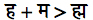
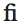

# Djehuty

Djehuty is an on-going project by Marwan Kilani (Freie Universität Berlin - Swiss National Science Foundation) aiming at the development of a Unicode font and Input Method for ancient Egyptian hieroglyphs.

A first working version of the font is already available and it is provided in the present repository.

A beta version of the Input Method will be published here soon.

## Unicode hieroglyphs: what for?

Unicode hieroglyphs are meant to provide an easy and effective way to transcribe Egyptian Hierogypliphs as strings of texts, rather than as automatically generated images, as it is the case of tools like jSesh. Dealing with hieroglyphs as strings of texts has a series of advantages: unicode hieroglpyhs can be used in and editor or text field, and can be manipulated as any other text. For instance, unicode hieroglyphs can be inserted, as text, within any text written with a text editor. They can also be searched using standard search tools, for instance in text editors or in online search engines. Unicode hieroglyphs can also be used, and searched for, in databases and in tables. They can be exported in standard .pdf files and searched within them.

Unicode hieroglyphs, however, can only be manipulated within the limits of the font used to display them. Overall, this means that unicode hierogplyphs are often not suited, and in fact are not meant for paleographically accurate transcriptions of texts on actual objects. Rather, they are meant to transcribe texts in a uniform way, for instance when a text has to be quote and discussed in a scientific paper because of its literary or linguistic content, rather than because of its actual appearence on the actual support.

Think about a medieval Latin manuscript: one can provide an accurate, form-wise paleographical copy of it, in which all the graphic peculiarities of letters characterising the style of the specific scribe are accurately reproduced, or one can provide a content-wise accurate transcription in a standard modern Latin-script font, for instance in the context of a critical edition of the text. Unicode hierogliphs are meant for the Egyptological equivalent of the latter.

## Font

   Download: 
   
   [EgyptianHiero 4.03](https://github.com/MKilani/Djehuty/blob/master/EgyptianHiero4.03.ttf)
   
   Font name: EgyptianHiero  
   Version: 4.03 - October 14 2019  
   Format: TrueType® Font

   Designed by Marwan Kilani, 2017-9.  
   Glyph outlines based on Mark-Jan Nederhof's font NewGardiner.  
   All Rights Reserved

   Legacy versions (these contain less ligatures, they are more suited for basic tasks):

   [EgyptianHiero 3.03 ttf](https://github.com/MKilani/Djehuty/blob/master/egyptianhiero3.03.ttf)

   [EgyptianHiero 3.03 woff](https://github.com/MKilani/Djehuty/blob/master/egyptianhiero3.03.woff)
   
   [EgyptianHiero 3.03 woff2](https://github.com/MKilani/Djehuty/blob/master/egyptianhiero3.03.woff2)

### How to cite

Kilani Marwan, 2019, Djehuty - Font EgyptianHiero 4.02 (4.3.2019), https://github.com/MKilani/Djehuty

### How the font works, and how to use it correctly

#### The problem

In actual texts, hieroglyphs are usually distributed into so-called "quadrats", namely virtual rectangles or squares that provide a conceptual frame to organize the signs into space. For instance, the signs  , are usually not written in a linear sequence, one after the other, but they are rather reorganized within a single quadrat, in the form  .

In contrast with other fonts, which display hieroglyphs only in linear sequences, EgyptianHiero reorganize the signs into quadrats.

#### Ligatures for quadrats

In order to organize and display the hieroglyphs into quadrats, the EgyptianHiero font uses a series of *ligatures* pre-encoded in the font itself.

In order to understand what this means, take the example of the English ligature  or the Sanskrit ligature  . In these cases, fonts that support ligatures will automatically turn any sequence f + i or  ह + म into their corresponding ligatures, thus displaying them as  and  respectively.

EgyptianHiero uses the same mechanism to organize signs into quadrats: every time the font encounters a sequence of signs corresponding to one of its pre-encoded ligatures, it will reorganize the signs into quadrats accordingly.

Therefore, every time the font will encounter a sequence , it will display it as a ligature/quadrat .

This approach has a series of implications that need to be considered:

1. Since ligatures are embedded in the font and automatically rendered, there is no need to use any special character to indicate the relative position of the signs. No need for positional cmarkers like : , * , - as in Manuel de Codage or Jsesh. Just input the hieroglyphs one after the other, the font will take care of grouping them into quadrats.

2. Since no special character is used, a quadrat  will still correspond to an underlying sequence . This means that in general search functions (e.g. in online search engines or text files and text editors) can find signs within quadrats, and can even find sequences of signs spread over different quadrats.

3. Only ligatures, i.e. only quadrats that are pre-encoded in the font can be displayed by the font. This is an important point: one cannot create custom quadrats using EgyptianHiero – only the quadrats that are already known by the font can be displayed. 

This is not an issue, as the font already contains over 3000 ligatures/quadrats, and new are added with each new release. Right now, most quadrats attested in the TLA are encoded, as well as many other extracted from various Late Egyptian texts. Most texts can thus be transcribed without relevant issues. However, I am still adding ligatures, as I encounter new quadrats in the texts I am working on - obviously the more texts one is transcribing, the more quadrats are encountered.

In this respect, Users are encouraged to send to me any additional quadrat they would like to have in the font: I will gladly add them in the next release.

Moreover, one also has to take into account the purpose of texts encode with Unicode fonts, on which see below § Unicode hieroglyphs: what for?

#### Breaking ligatures

As said, EgyptianHiero does not use any special character to create quadrats – quadrats are generated automatically every time the font encounters a relevant sequence of characters. There are cases, however, where one may NOT want two signs to be combined into a ligature/quadrat. Conflicts between ligatures can also happen, as the font process ligatures according the direction of writing. This means that if e.g. both the signs A-B and the signs B-C form a ligature, in the case of a sequence A-B-C, the font will always display the ligature A-B (which comes first) and never the ligature B-C (which follows).

##### Breaking Ligature Character

This issue can be easily solved by using a Breaking Ligature Character (BLC). A BLC is a special invisible character that prevents the font from joining two signs into a quadrat. The sign I use to use for this purpose is the special character Zero-width space (ZWSP – unicode U+200B – see [Wiki: Zero-Width Space](https://en.wikipedia.org/wiki/Zero-width_space) ).

An alternative sign that could be used is the Zero-width non-joiner (ZWNJ – unicode U+200C – see [Wiki: Zero-Width non-joiner]( https://en.wikipedia.org/wiki/Zero-width_non-joiner ) ).

For now, I prefer the first as it is easier to manipulate in text editors like LibreOffice. However, and comment or suggestion on this point is welcome.

##### Search with Breaking Ligature Character

Browsers and online search engines deal with the ZWSP in different ways. Some just ignore it, which means that sequences of hieroglyphs can be found even though they are distributed over different quadrats separated by ZWSP.

As for text editors, they often have search functions that ignore white spaces. These functions can be used to ignore the ZWSP.

These features, however, tend to change from one version to the other, and more testing is needed to define the specific behaviours of every software and version. Here as well, any consideration, comment or suggestion is welcome.

##### Visualizing the Breaking Ligature Character

The ZWSP is invisible in the final output, but various text editors allow displaying it together with other Formatting Marks when the Formatting Marks option is activated. 
Therefore, for instance:

- Without Formatting Marks option activated

- With Formatting Marks option activated

##### When to use the Breaking Ligature Character – suggest best practice

Breaking Ligature Characters can be used in two ways.

1. The first option is to use them only to prevent the display of specific wrong ligatures.

2. The second option is to use them between every quadrat and in general to separate every sign that is not supposed to form a ligature.

Consider the following two examples: the two sentences in the image are displayed exactly in the same way:

Their underlying structure, however, is different, one reflecting the first approach, the other reflecting the second.

Both approaches are valid, depending on the context and use of the text.

In case of static texts that are not going to be modified in the future (e.g. the texts meant to be published in articles and monographs), the first approach is probably more practical. By contrast, in the case of texts that are expected to be used and edited in the future (e.g. in database and text corpora) the second approach may be more appropriate, as it ensures compatibility with future versions of the font – by separating ever sign that should NOT be joined by a ligature, one is sure that the rendition of the text will not be affected by the addition of new ligatures in future versions of the font.

## Input Method

Coming soon.

## Examples

The font EgyptianHiero has being used in the following projects and publications:

* **Digitale Einführung in die hieroglyphisch-ägyptische Schrift und Sprache**  
   Daniel A. Werning  
   Humboldt-Universität zu Berlin: Berlin 2018–...  
   https://wikis.hu-berlin.de/ancientegyptian/Inhaltsverzeichnis

–-

Last Update: 21.10.2019

